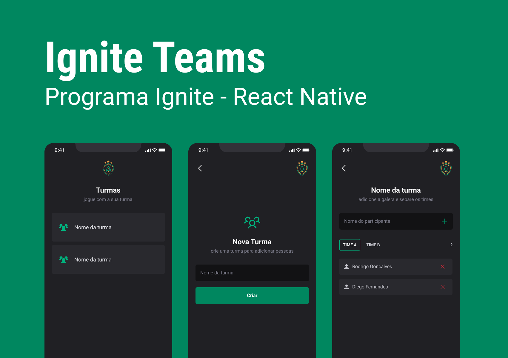

# Gerenciador de Turmas e Jogadores



Este aplicativo React Native permite o gerenciamento de turmas e jogadores. Ele oferece funcionalidades para adicionar, remover e listar turmas, bem como adicionar, remover e listar jogadores associados a essas turmas.

## Funcionalidades Principais

- **Turmas:** Adicionar, remover e listar turmas.
- **Jogadores:** Adicionar, remover e listar jogadores associados a turmas.
- **Organização por Times:** Possibilidade de organizar jogadores em diferentes times dentro de uma turma.

## Tecnologias Utilizadas

- **React Native:** Utilizado para o desenvolvimento da aplicação móvel.
- **AsyncStorage:** Armazenamento local utilizado para manter os dados das turmas e jogadores.
- **React Navigation:** Gerenciamento de rotas e navegação entre telas.

## Instalação

1. **Clonar o Repositório:**

   ```bash
   git clone https://github.com/seu-usuario/nome-do-projeto.git
   ```
   
## Uso

- **Adicionar uma Nova Turma:** Na tela principal, clique no botão "Nova Turma" e insira o nome da turma desejada.
- **Adicionar Jogadores:** Selecione uma turma e adicione jogadores informando seus nomes e times.
- **Remover Turma ou Jogador:** Remova turmas ou jogadores selecionando o item desejado e escolhendo a opção de remoção.

## Estrutura do Projeto

- `src/`: Contém os arquivos fonte do aplicativo.
- `components/`: Componentes reutilizáveis.
- `screens/`: Telas principais do aplicativo.
- `storage/`: Funções para manipulação do AsyncStorage.
- `utils/`: Utilitários e funções auxiliares.

## Licença

Este projeto está sob a licença MIT. Consulte o arquivo LICENSE para obter mais informações.